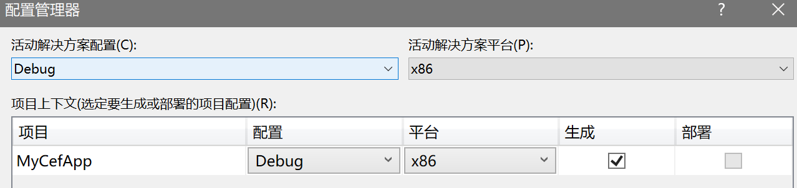
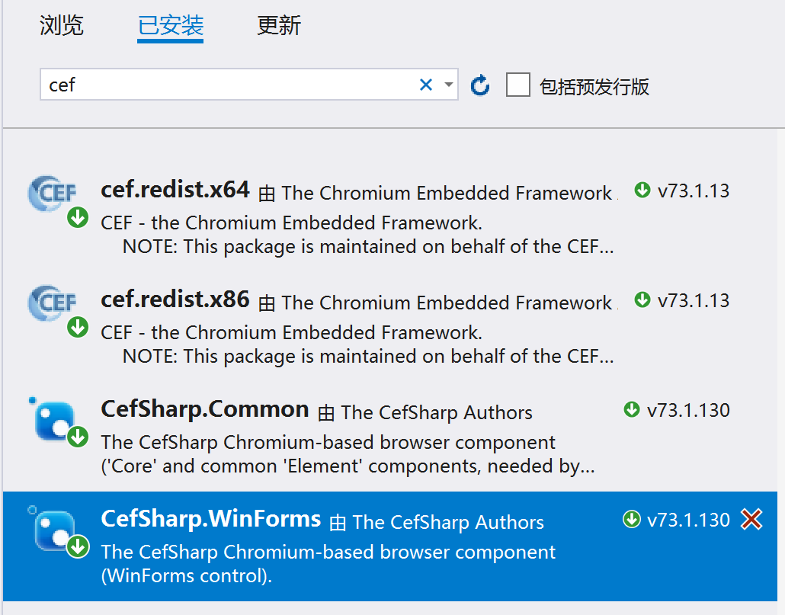
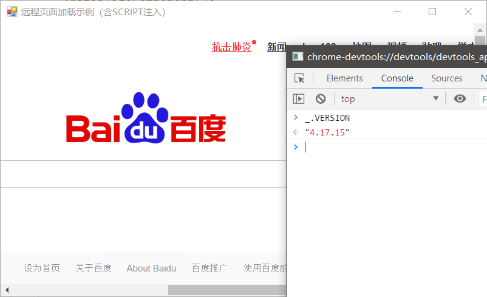

# winform-cefsharp-demo

[CefSharp](https://github.com/cefsharp/CefSharp) 是 .NET 平台基于 Chromium 的开源框架，适用于 Windows Forms 和 WPF 应用。

优点显而易见，是为数不多的桌面端 WEB 方案之一，基于 Chromium 本身的引擎特性，拥有目前最好的 Web 标准兼容性；缺点就是 CPU 和内存消耗较大，另外编译后磁盘容量占用也不小。

### 重点内容

1. CefSharp 组件在编译时会检查平台，[通常来讲 Any CPU 方案是不可行的](https://github.com/cefsharp/CefSharp/issues/1714)，需要指定平台为 x86 或是 x64。
2. 目前版本中已经改变了对象的注入方式。

### 首次使用

#### 1. 创建WinForms项目，并将项目属性设置为x86平台



可根据实际需要选择 x86 或 x64 平台。

#### 2. 通过 Nuget 包管理器引用 CefSharp 组件



从 **Nuget 包管理器**安装 **CefSharp.WinForms** 包，会自动下载其他依赖的包。

#### 3. 加载本地页面

新建窗体，并输入以下代码

```csharp
private ChromiumWebBrowser _chromiumWebBrowser;

public LocalPageForm()
{
    InitializeComponent();
    Load += LocalPageForm_Load;
}

private void LocalPageForm_Load(object sender, EventArgs e)
{
    var localPage = Path.Combine(Environment.CurrentDirectory, "Pages", "new.html");
    _chromiumWebBrowser = new ChromiumWebBrowser(localPage); //加载页面
    _chromiumWebBrowser.Dock = DockStyle.Fill;
    // 页面加载完毕后打开开发者工具
    _chromiumWebBrowser.FrameLoadEnd += (s, eve) =>
    {
        var browser = _chromiumWebBrowser.GetBrowser();
        browser.ShowDevTools();
    };
    JsObjectResolver(); // 新版本的注入方式
    Controls.Add(_chromiumWebBrowser);
}

private void JsObjectResolver()
{
    // 由网页端 CefSharp.BindObjectAsync 触发
    _chromiumWebBrowser.JavascriptObjectRepository.ResolveObject += (s, eve) =>
    {
        var repo = eve.ObjectRepository;
        if (eve.ObjectName == "storeObj")
        {
            // 在 new.html 使用 storeObj 触发
            repo.Register("storeObj", new Store(), isAsync: true);
        }
    };
}
```

加载本地页面需要在本地创建HTML页面，以上图中 73 版本为例，在创建以下简单页面`pages/new.html`，并设置属性**复制到输出目录：如果较新则复制**。

```html
<ul>
    <li><button onclick="n()">新式调用</button></li>
</ul>
<script>
    CefSharp.BindObjectAsync("storeObj"); //这里会触发Form端的ResolveObject事件
    function n() {
        // 注意异步方法的输出顺序
        var r1 = storeObj.buy(15);
        console.log(r1)
        storeObj.sell().then((r2) => {
            console.log(r2)
        });
        console.log("end");
    }
</script>
```

#### 4. 加载远程页面，并注入需要的脚本

```csharp
_chromiumWebBrowser = new ChromiumWebBrowser("https://www.baidu.com");
_chromiumWebBrowser.Dock = DockStyle.Fill;
_chromiumWebBrowser.FrameLoadEnd += (s, eve) =>
{
    var browser = _chromiumWebBrowser.GetBrowser();
    browser.ShowDevTools();

    var scritps = new string[] {
        "var scr = document.createElement('script');",
        "scr.type = 'text/javascript';",
        "scr.src = 'https://cdn.bootcdn.net/ajax/libs/lodash.js/4.17.15/lodash.js';",
        "document.head.appendChild(scr);"
    };

    _chromiumWebBrowser.EvaluateScriptAsync(string.Join(";", scritps));
    MessageBox.Show("可在控制台中使用 _.VERSION 调用测试", "Loadsh.js 注入完成");
};
this.Controls.Add(_chromiumWebBrowser);
```

上述代码以百度为例，注入了 [lodash.js](http://lodashjs.com/) 库（同时推荐一下这个工具脚本库）。

可以看到通过 `EvaluateScriptAsync` 方法去让页面执行指定的脚本，可以满足一些特殊需求。



### 写在最后

老版本的使用方法这里就不说了，目前网上能找到的大部分都是老版本的使用方法。

```c#
// 1. 旧版本的注入方式，从后端到前端，官方不建议使用（已过时）
CefSharpSettings.LegacyJavascriptBindingEnabled = true;
_chromiumWebBrowser.RegisterJsObject("obs", new TestClass());
// 页面无需绑定（因为是全局的）

// 2. 新版本的注入方式，收到前端请求后再注入，官方推荐
_chromiumWebBrowser.JavascriptObjectRepository.ResolveObject += (s, eve) =>  {
	var repo = eve.ObjectRepository;
    if (eve.ObjectName == "storeObj")
    {
        repo.Register("storeObj", new Store(), isAsync: true);
    }
}
// 2.1 页面绑定
CefSharp.BindObjectAsync("storeObj");
```

